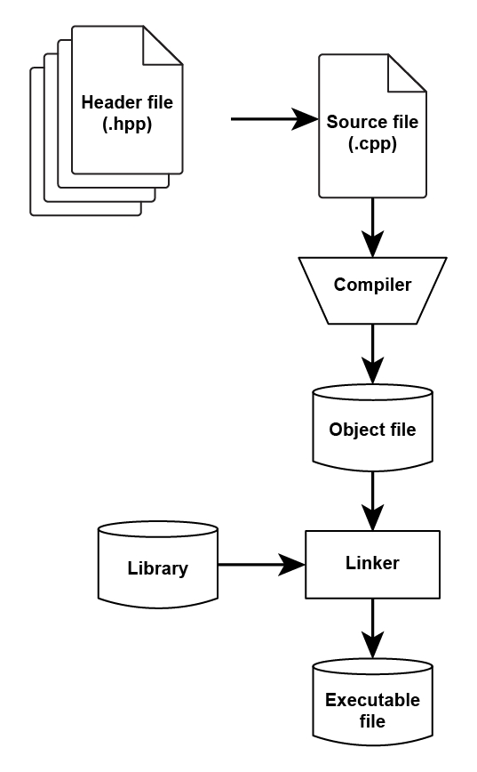
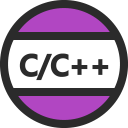
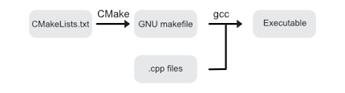
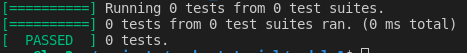

# From source to binary
---
# Hello world
```cpp
#include <iostream>
int main()
{
    std::cout << "Hello World !!" << std::endl;
    return 0;
}
```

```
g++ main.cpp -o hello
```


---
# Compiler and Linker
- Recompile all the `#` commands
- Convert code into object file
- Combine object files and libraries into binary / Executable



---
# Product 

```

$ ll -h
-rwxrwxr-x 1 user user  17K Feb 27 19:29 hello*
-rw-rw-r-- 1 user user   97 Feb 27 19:27 main.cpp
```

```bash
$ file hello
hello: ELF 64-bit LSB shared object, x86-64, version 1 (SYSV), 
dynamically linked, interpreter /lib64/ld-linux-x86-64.so.2,
...
for GNU/Linux 3.2.0, not strippe
```
---

# Product II

```
$ g++ main.cpp -static -o hello_static
```

```
$ file hello_static
hello_static: ELF 64-bit LSB executable, x86-64, version 1 (GNU/Linux), statically linked,
```

```
ll -h hello_static
-rwxrwxr-x 1 user user 2.3M Feb 27 20:39 hello_static*
```

---
# Run Time Linker

- Run time linker
  - libstdc++.so.6
  - libc.so.6
- Search path's
  - /lib, /usr/lib
  - /etc/ld.so.conf
  - LD_LIBRARY_PATH
```
readelf -d hello
readelf -d hello_static
```

---
# Debugger
- Symbols

```
gdb hello
```

```
g++ -g main.cpp -o g_hello
# 
gdb g_hello
```
```
objcopy --only-keep-debug g_hello g_hello.debug
gdb -s g_hello.debug -e g_hello
```


---
# Time for 3 letters
- gcc and g++ are the GNU compiler for C and C++
- clang and clang++ are the LLVM compiler for C and C++
- ld linker
- gdb GNU debugger
- lldb LLVM debugger


---
# OS Compilers and CPP versions
- C++11, C++14, C++17, C++20
- GCC 9 support c++20 features (experimental)
- Clang 12 support C++20 (partial)
- Ubuntu 20.04 repository contain GCC-9 and Clang-12
  
```bash
# Build with c++20 support
g++ -std=c++2a main.cpp -o main
# -std=c++20 from gcc-10 
```

---
# VSCode
 C/C++ IntelliSense, debugging, and code browsing.
 CMake langage support
 Extended CMake support

---
# VSCode (task)
```json title="task"
{
    "label": "build hello",
    "type": "cppbuild",
    "command": "g++",
    "args": [
        "-g",
        "-std=c++2a",
        "${file}",
        "-o",
        "${fileDirname}/${fileBasenameNoExtension}"
    ]
}
```

```
"C_Cpp.default.cppStandard": "c++20"
```
---
# Buildsystem  
- Make (Makefiles) is a buildsystem - it drive the compiler to build code
- CMake: generator of buildsystems



---
# cmake


---
# Minimal CMakeLists.txt
```cmake
cmake_minimum_required(VERSION 3.0.0)
project(MODULE_1)

add_executable(hello main.cpp)
```

---
# VSCode (task)

```json
{
    "label": "cmake",
    "type": "shell",
    "command": "cmake",
    "args": [
        ".."
    ],
    "options": {
        "cwd": "${workspaceRoot}/module1/build"
    }
}
```
---
# CMAKE
```
set(CMAKE_BUILD_TYPE Debug)
```

```
target_compile_features(calc PRIVATE cxx_std_20)
```

---
# Errors
- Compile time error
- Run time error
- Warnings

```cpp
#include <iostream>

int main()
{
    std::cout << "Hello World !!" << std::endl;
    int value = 7/0;
    return 0;
}
```

--- 
# Tests / googletest
- Build and Install [download](https://github.com/google/googletest/releases)
- Write tests
- Build and test

```
# unzip
cd source
mkdir build
cd build
cmake ..
make
sudo make install
```

---
# First test
```
#include <iostream>
#include <gtest/gtest.h>

int main(int argc, char **argv){
    testing::InitGoogleTest(&argc, argv);
    return RUN_ALL_TESTS();
}
```

```
g++ test.cpp  -lgtest -lgtest_main -pthread -o tests
```



---
# First Test

```
#include <iostream>
#include <gtest/gtest.h>

TEST( Suite, first_test)
{
    ASSERT_TRUE(1 == 1);
}

int main(int argc, char **argv){
    testing::InitGoogleTest(&argc, argv);
    return RUN_ALL_TESTS();
}
```